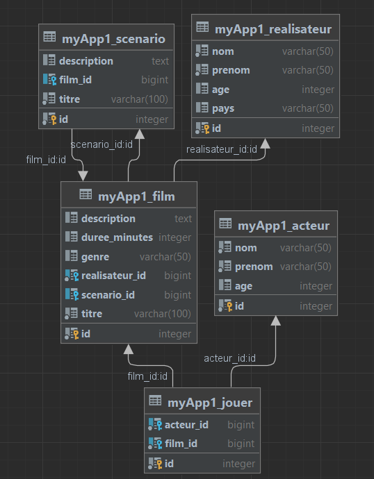

# Exam Django

[](https://www.djangoproject.com/)
[](https://www.django-rest-framework.org/)
[](https://swagger.io/)
[](https://git-scm.com/)
[](https://git-scm.com/)

LINK :
https://github.com/FazCodeFR/Exam-Django

## Table des matières

- [Présentation](#présentation)
- [Stack technologique](#stack-technologique)
- [Assurance de la qualité du code](#assurance-de-la-qualité-du-code)
- [Installation](#installation)
- [Techniquement](#techniquement)
- [Fonctionnalités](#fonctionnalités)
- [SQL INSERT DATA](#sql-insert-data)
- [Plugins conseillés](#plugins-conseillés)
- [Support/Docs](#support)

## Contexte

La filmothèque ‘LaFilmothequeDuSud’ aimerait avoir à disposition une application Web lui
permettant le suivi de ses films..
Cette application Web doit être solide, sécurisée, évolutive et avoir une bonne scalabilité.
Pour ce faire, la filmothèque a choisi une solution découplée, où une application front
correspondant à l’IHM sera développée et interagira avec une API Rest qui correspondra au
backoffice. Elle a recruté une équipe de développeurs, le problème étant que l’équipe est
staffer au maximum côté Frontend mais manque de compétence sur la partie Backend.
C’est donc dans ce cadre que vous avez été appelés en renfort pour développer l’API en
question.

## Stack technologique

- Django Rest Framework
- Sqlite3
- Swagger

# Assurance de la qualité du code

Des mesures ont été recommandées pour assurer la qualité optimale du code et faciliter son maintien. Celles-ci incluent :

- Documentation de l'API à l'aide de Swagger, ce qui permettra la génération automatique de la documentation de l'API et sa rendra plus accessible pour les utilisateurs.

- Ajout de commentaires clairs et concis au code, ce qui aidera les développeurs à comprendre son fonctionnement et à le maintenir en cas de besoin.

- Utilisation d'un Linter comme Eslint pour vérifier la qualité du code et l'adapter aux standards de codage, ce qui permettra de corriger les erreurs de syntaxe et de formatage et d'améliorer la qualité du code.

- Formatage du code avec Prettier pour le rendre plus lisible, ce qui aidera les développeurs à comprendre et à maintenir le code plus facilement.

## Installation

- Télécharger Django
  pip install Djang

- Cloner le projet

```shell
git clone https://github.com/FazCodeFR/Exam-Django.git -b laBrancheVoulu
cd Exam-Django
```

- Activer l'environnement virtuel

```shell
source path/venv/Scripts/activate

```

- Lancer le projet

```python
py manage.py runserver
Par default le serveur est http://127.0.0.1:8000/
```

````

## Techniquement

L'authentification est gérée par JWT.

Seul l’administrateur doit pouvoir ajouter/modifier/supprimer des éléments,
les autres ne peuvent que consulter les informations

Swagger n'affiche que les Get car à son lancement il n'y a pas de token

## Fonctionnalités

- CRUD sur les films, les genres, les acteurs, les réalisateurs, les scenarios, les clients et les emprunts

- Rajout de colonne bonus dans les tables


## Admin

- username : dev
- password : dev

Pour généré un token :


## SQL INSERT DATA

```sql
INSERT INTO myApp1_acteur (nom, prenom, age) VALUES
('Smith', 'John', 30),
('Doe', 'Jane', 25),
('Brown', 'Mike', 40),
('Garcia', 'Maria', 35),
('Lee', 'David', 28),
('Kim', 'Sophie', 23);


INSERT INTO myApp1_realisateur (nom, prenom, age, pays)
VALUES
  ('Spielberg', 'Steven', 75, 'USA'),
  ('Lee', 'Ang', 67, 'Taiwan'),
  ('Bigelow', 'Kathryn', 70, 'USA'),
  ('Kubrick', 'Stanley', 70, 'UK'),
  ('Hitchcock', 'Alfred', 80, 'UK'),
  ('Tarantino', 'Quentin', 58, 'USA'),
  ('Coen', 'Ethan', 64, 'USA'),
  ('Coen', 'Joel', 67, 'USA');


INSERT INTO myApp1_film (description, duree_minutes, genre, realisateur_id, scenario_id, titre)
VALUES
  ('A young farmhand becomes a knight and battles a dragon to save a princess', 120, 'Action', 1, 1, 'Dragon Slayer'),
  ('A group of survivors must fight their way through a post-apocalyptic wasteland to reach safety', 90, 'Horror', 2, 2, 'The Road'),
  ('A hacker seeks revenge against a corrupt government agency that wronged him', 135, 'Thriller', 3, 3, 'Hacktivist'),
  ('A group of scientists discover a way to time-travel and must stop an apocalyptic event', 110, 'Science Fiction', 4, 4, 'The Time Travelers'),
  ('A group of friends go on a road trip and discover a hidden conspiracy', 95, 'Mystery', 5, 5, 'The Highway'),
  ('A man must navigate through a city filled with zombies to rescue his daughter', 100, 'Horror', 6, 6, 'Zombie City'),
  ('A detective investigates a series of murders that all seem connected to a mysterious book', 120, 'Mystery', 7, NULL, 'The Book of Murders'),
  ('A group of thieves attempt to pull off the biggest heist in history', 130, 'Action', 8, 7, 'The Big Score');


INSERT INTO myApp1_scenario (description, film_id, titre)
VALUES
  ('A young farmhand becomes a knight and battles a dragon to save a princess', 1, 'Dragon Slayer'),
  ('A group of survivors must fight their way through a post-apocalyptic wasteland to reach safety', 2, 'The Road'),
  ('A hacker seeks revenge against a corrupt government agency that wronged him', 3, 'Hacktivist'),
  ('A group of scientists discover a way to time-travel and must stop an apocalyptic event', 4, 'The Time Travelers'),
  ('A group of friends go on a road trip and discover a hidden conspiracy', 5, 'The Highway'),
  ('A man must navigate through a city filled with zombies to rescue his daughter', 6, 'Zombie City'),
  ('A detective investigates a series of murders that all seem connected to a mysterious book', 7, 'The Book of Murders'),
  ('A group of thieves attempt to pull off the biggest heist in history', 8, 'The Big Score');

````

## Probleme rencontré

"Une documentation de l’API détaillé" => Je n'ai pas pu implementer cette fonctionnalité car le package swagger que j'ai utilisé est obsolète ne permet pas de tout faire (j'ai passé du temps a essayer de le faire fonctionné)

## Diagramme de classe



## Plugins conseillés

Eslint : Linter
Prettier : Code formater

## Support

[Django moodle](https://moodle.ynov.com/pluginfile.php/718730/mod_resource/content/7/02.%20DJANGO.pptx.pdf)

[Consigne Examen Django DRF](https://moodle.ynov.com/pluginfile.php/724742/mod_resource/content/1/Examen%20Django%20DRF.docx.pdf)
